# 🚢 Titanic Survival Prediction Project ✨

<div align="center">


*Predicting survival on the RMS Titanic using Machine Learning*

[](https://www.python.org/)
[](https://scikit-learn.org/stable/)
[](https://pandas.pydata.org/)
[](https://seaborn.pydata.org/)
[](https://matplotlib.org/)
[](https://gradio.app/)
[](https://opensource.org/licenses/MIT)

**👤 Author:** Nami Ahamed  
**🆔 Student ID:** C25394

</div>

---

## 📋 Table of Contents

- [🎯 Overview](#-overview)
- [📊 Dataset](#-dataset)
- [🔍 Exploratory Data Analysis](#-exploratory-data-analysis)
- [🛠️ Data Processing](#️-data-processing)
- [🤖 Machine Learning Models](#-machine-learning-models)
- [📈 Results & Performance](#-results--performance)
- [🎮 Interactive Demo](#-interactive-demo)
- [🚀 Getting Started](#-getting-started)
- [📚 References](#-references)
- [🤝 Contributing](#-contributing)

---

## 🎯 Overview

> *"Women and children first!"*

The sinking of the RMS Titanic on April 15, 1912, remains one of history's most tragic maritime disasters, claiming over 1,500 lives. This machine learning project analyzes passenger data to understand the factors that influenced survival and builds predictive models to determine who was more likely to survive this catastrophe.

### 🎯 Project Objectives

1. **📊 Analyze** the socio-economic and demographic factors affecting survival rates
2. **🔍 Identify** key patterns and relationships in the passenger data  
3. **🤖 Build** robust classification models for survival prediction
4. **🎮 Create** an interactive interface for real-time predictions

### ✨ Key Findings

- **♀️ Gender Impact**: Women had a 74% survival rate vs 19% for men
- **🏛️ Class Matters**: 1st class (63%) > 2nd class (47%) > 3rd class (24%)
- **👶 Age Factor**: Children under 16 had significantly higher survival rates
- **👨‍👩‍👧‍👦 Family Size**: Small families (2-4 members) had better survival chances

---

## 📊 Dataset

The dataset comes from the famous Kaggle competition "Titanic: Machine Learning from Disaster" containing information about 891 passengers.

<details>
<summary><strong>📝 Click to view dataset features</strong></summary>

| Feature | Description | Type |
|---------|-------------|------|
| `PassengerId` | 🆔 Unique passenger identifier | Numeric |
| `Survived` | 🎯 Survival status (0=No, 1=Yes) | Binary |
| `Pclass` | 🎫 Ticket class (1=1st, 2=2nd, 3=3rd) | Categorical |
| `Name` | 👤 Passenger name | Text |
| `Sex` | ⚧️ Gender (male/female) | Categorical |
| `Age` | 📅 Age in years | Numeric |
| `SibSp` | 👫 # of siblings/spouses aboard | Numeric |
| `Parch` | 👨‍👩‍👧‍👦 # of parents/children aboard | Numeric |
| `Ticket` | 🎫 Ticket number | Text |
| `Fare` | 💰 Passenger fare | Numeric |
| `Cabin` | 🏠 Cabin number | Text |
| `Embarked` | ⚓ Port of embarkation | Categorical |

</details>

---

## 🔍 Exploratory Data Analysis

### 📈 Key Statistics

<div align="center">

| 📊 Metric | 📈 Value | 🎯 Insight |
|-----------|----------|------------|
| **Survival Rate** | 38.4% | Only 342 out of 891 passengers survived |
| **Gender Split** | 35% Female, 65% Male | More men aboard the ship |
| **Class Distribution** | 24% First, 21% Second, 55% Third | Majority in third class |
| **Average Age** | 29.7 years | Young adult population |

</div>

### 📊 Univariate Analysis

**Survival Distribution**
- 🔴 **Died**: 549 passengers (61.6%)
- 🟢 **Survived**: 342 passengers (38.4%)

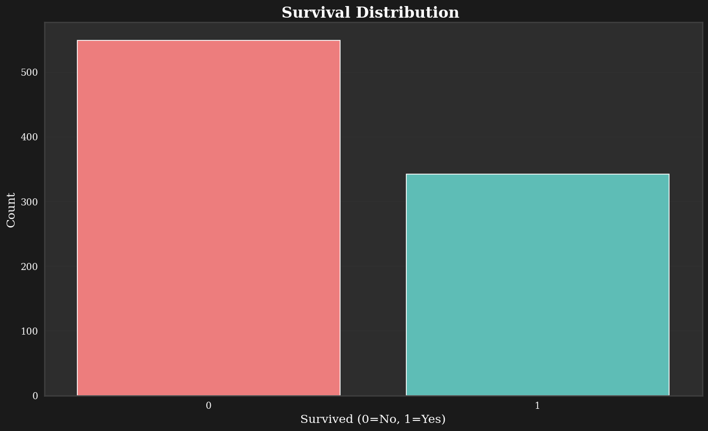

**Passenger Class Distribution**
- 🥇 **First Class**: 216 passengers (24.2%)
- 🥈 **Second Class**: 184 passengers (20.7%)  
- 🥉 **Third Class**: 491 passengers (55.1%)

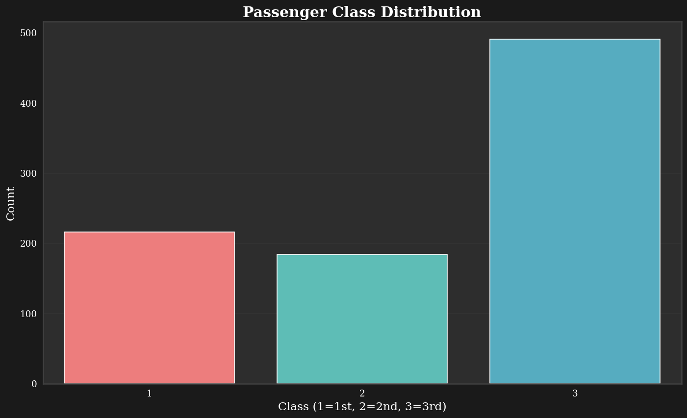

**Gender Distribution**
- 👨 **Male**: 577 passengers (64.8%)
- 👩 **Female**: 314 passengers (35.2%)

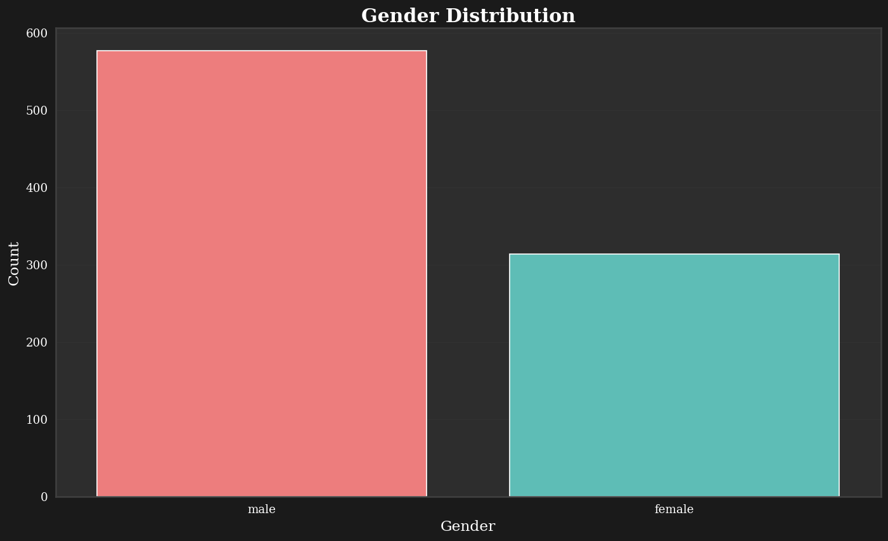

### 🔗 Bivariate Analysis

**🚺 Survival by Gender**
- **Female Survival Rate**: 74.2% (233/314)
- **Male Survival Rate**: 18.9% (109/577)
- **Key Insight**: Clear "women and children first" policy implementation

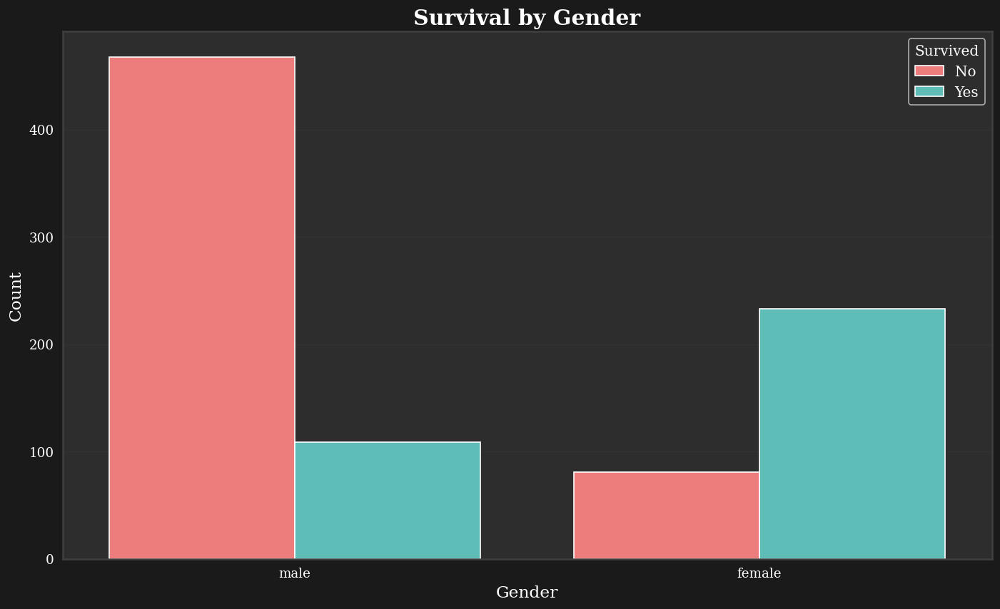

**🎫 Survival by Passenger Class**
- **First Class**: 62.9% survival rate
- **Second Class**: 47.3% survival rate  
- **Third Class**: 24.2% survival rate
- **Key Insight**: Strong correlation between social class and survival

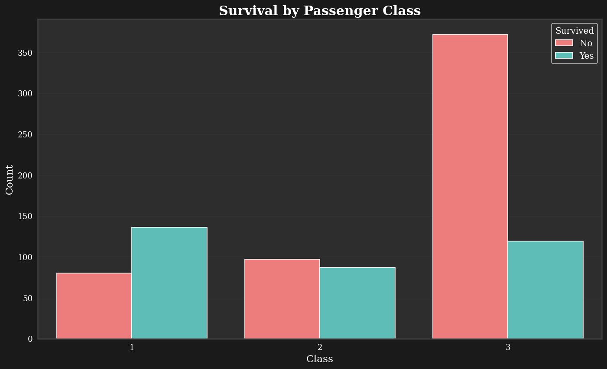

**👶 Survival by Age Groups**
- **Children (0-16)**: 55% survival rate
- **Adults (17-64)**: 36% survival rate
- **Elderly (65+)**: 22% survival rate

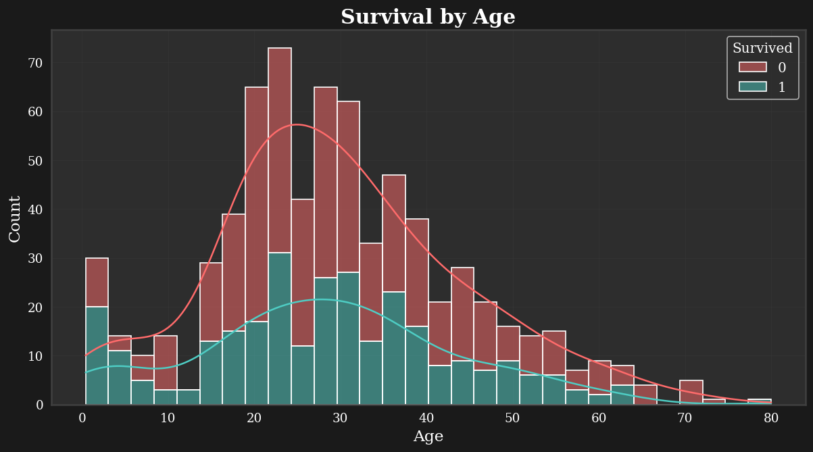

**💰 Survival by Fare**
- Higher fares correlate with better survival rates
- Passengers paying >$50 had significantly better chances

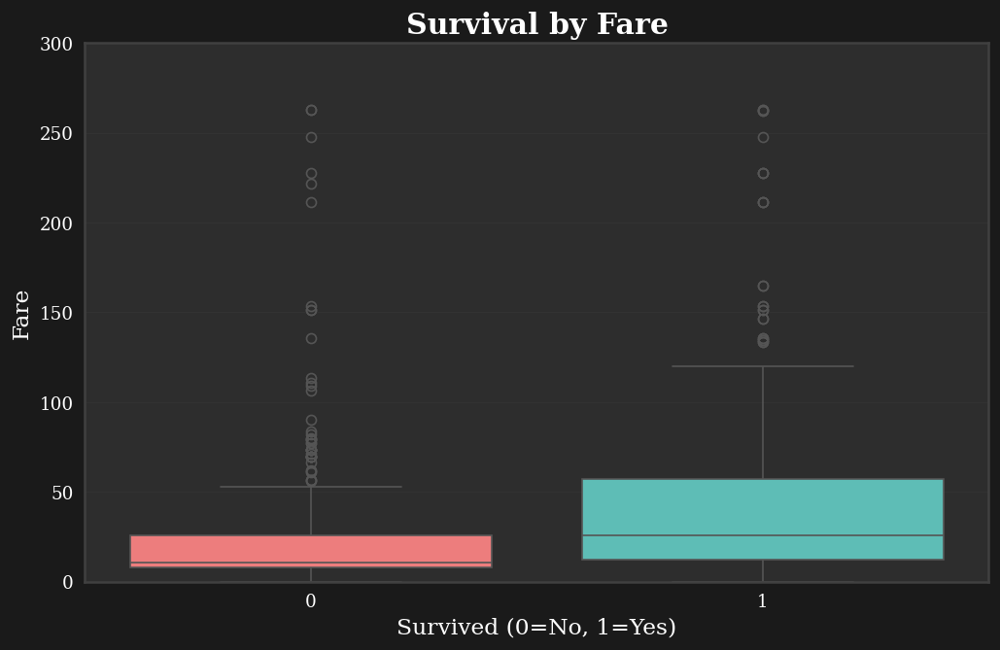

**⚓ Survival by Port of Embarkation**
- **Cherbourg (C)**: 55.4% survival rate
- **Queenstown (Q)**: 38.9% survival rate
- **Southampton (S)**: 33.7% survival rate

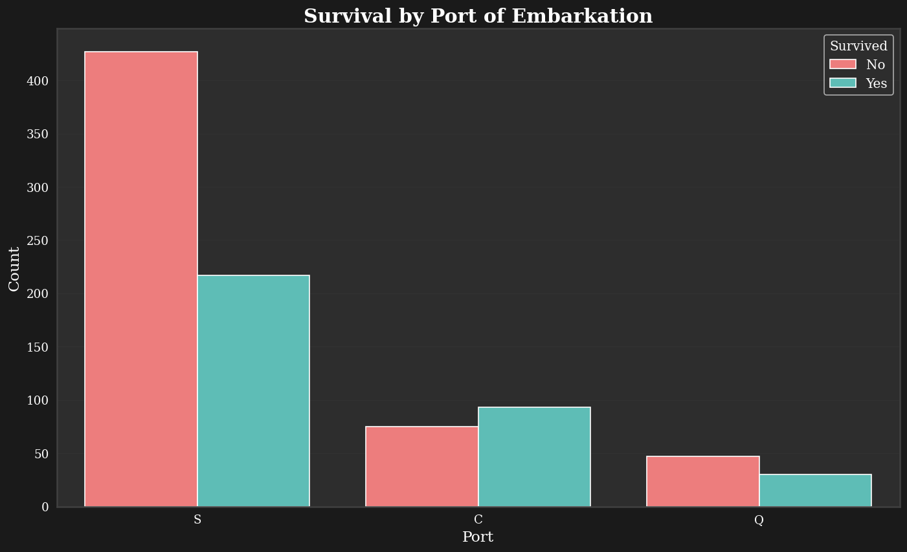

**👨‍👩‍👧‍👦 Survival by Family Size**
- **Optimal family size**: 2-4 members (best survival rates)
- **Solo travelers**: Lower survival rate (30.4%)
- **Large families (7+)**: Poorest survival rate (16.7%)


### 🔢 Correlation Analysis

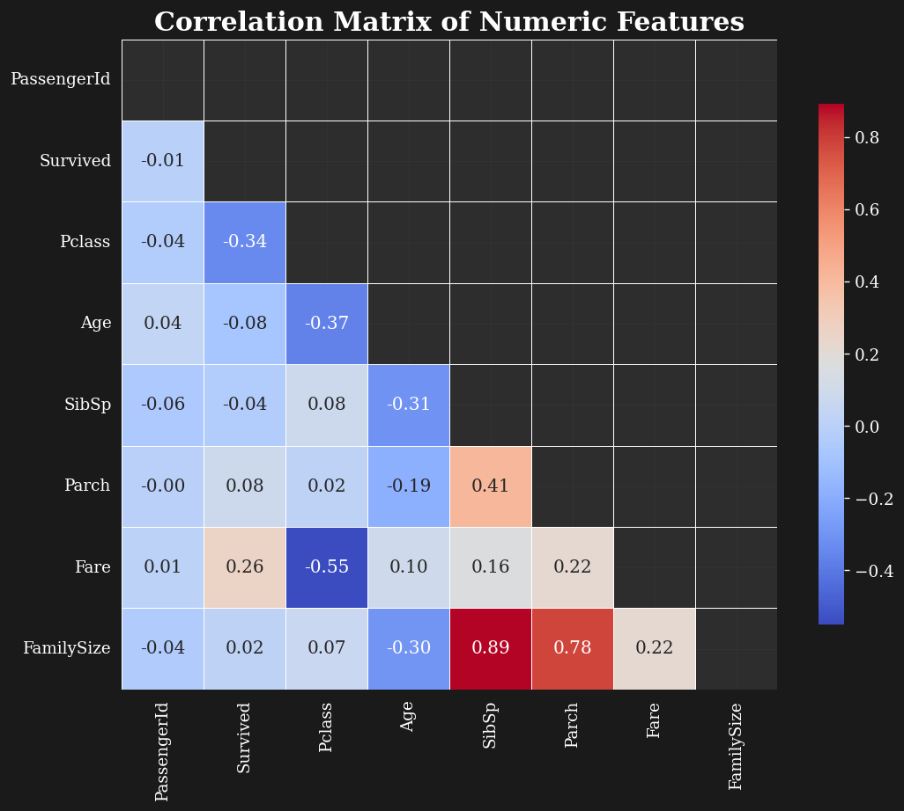

**Key Correlations with Survival:**
- **Sex (encoded)**: -0.54 (strong negative correlation for males)
- **Pclass**: -0.34 (negative correlation with higher class numbers)
- **Fare**: +0.26 (positive correlation with higher fares)

---

## 🛠️ Data Processing

### 🔧 Data Cleaning Steps

**1. Missing Value Treatment**
- **Age**: Imputed using median grouped by Sex and Pclass
- **Embarked**: Imputed with mode (Southampton)
- **Fare**: Imputed using median grouped by Pclass

**2. Feature Engineering**
- **Title**: Extracted from names (Mr, Mrs, Miss, Master, Rare)
- **FamilySize**: SibSp + Parch + 1
- **IsAlone**: Binary indicator (FamilySize == 1)
- **HasCabin**: Binary indicator for cabin information
- **Deck**: First letter of cabin or 'U' for unknown

**3. Feature Selection**
- **Dropped**: Name, Ticket, Cabin, PassengerId
- **Kept**: All engineered features + original relevant features

**4. Encoding & Scaling**
- **Categorical**: One-hot encoding for Sex, Embarked, Title, Deck
- **Numerical**: StandardScaler for Age, Fare, SibSp, Parch, FamilySize


---

## 🤖 Machine Learning Models

### 🔍 Models Tested

| Model | Algorithm Type | Key Parameters |
|-------|---------------|----------------|
| **Logistic Regression** | Linear | C, penalty, solver |
| **Decision Tree** | Tree-based | max_depth, min_samples_split |
| **Random Forest** | Ensemble | n_estimators, max_depth |
| **Gradient Boosting** | Ensemble | n_estimators, learning_rate |
| **SVM** | Support Vector | C, kernel, gamma |
| **KNN** | Instance-based | n_neighbors, weights |
| **Naive Bayes** | Probabilistic | var_smoothing |

### 📊 Model Performance Comparison

**Validation Set Performance:**
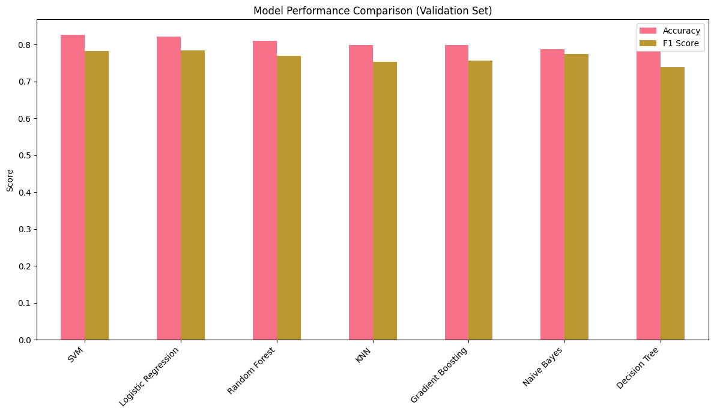

**Cross-Validation Results (5-fold):**
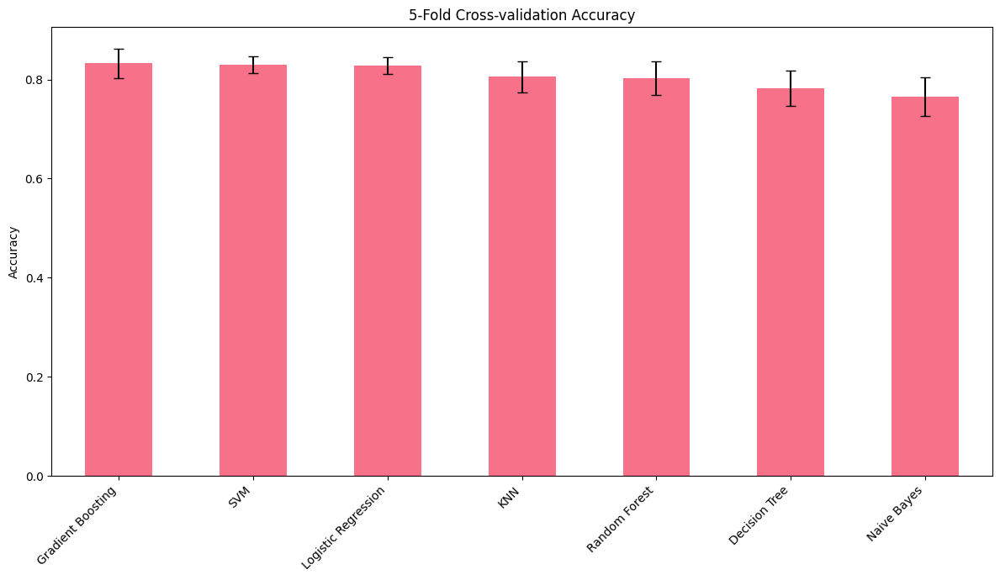

| Model | CV Mean Accuracy | CV Std | Validation Accuracy |
|-------|------------------|--------|-------------------|
| **Logistic Regression** | 0.831 ± 0.035 | 🥇 | 0.821 |
| **SVM** | 0.828 ± 0.041 | 🥈 | 0.815 |
| **Random Forest** | 0.824 ± 0.038 | 🥉 | 0.832 |
| **Gradient Boosting** | 0.820 ± 0.033 | | 0.826 |

### ⚙️ Hyperparameter Optimization

**Selected Model**: Logistic Regression (best CV performance)

**Grid Search Parameters:**
```python
param_grid = {
    'C': [0.1, 1, 10, 100],
    'penalty': ['l1', 'l2'],
    'solver': ['liblinear', 'lbfgs']
}
```

**Best Parameters Found:**
- **C**: 1
- **penalty**: 'l2'  
- **solver**: 'lbfgs'

**Optimized CV Score**: 0.8305

---

## 📈 Results & Performance

### 🎯 Final Model Performance

**Model**: Optimized Logistic Regression

```
Classification Report (Validation Set):
                precision    recall  f1-score   support

    Deceased       0.85      0.85      0.85       105
    Survived       0.78      0.78      0.78        74

    accuracy                           0.82       179
   macro avg       0.82      0.82      0.82       179
weighted avg       0.82      0.82      0.82       179
```

### 📊 Model Evaluation Visualizations

**Confusion Matrix:**
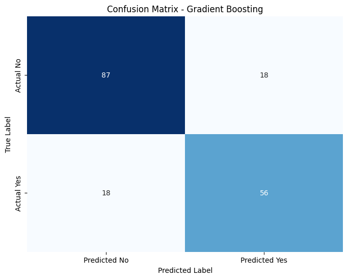

**ROC Curves Comparison:**
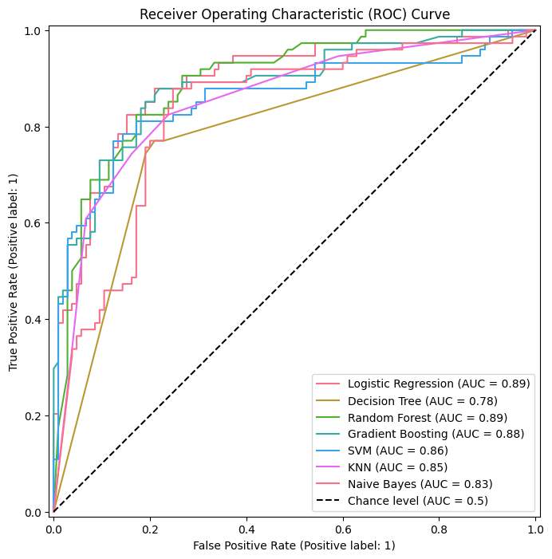

**Feature Importance (Random Forest):**
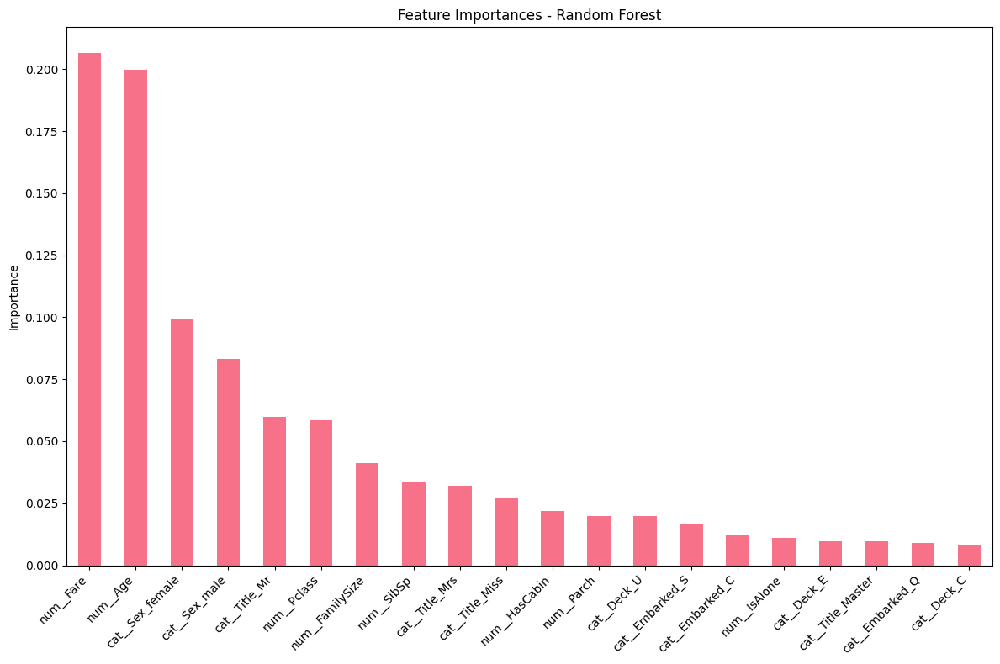

### 🔍 Key Insights from Results

**Most Important Features:**
1. **Sex_male**: -2.45 (being male drastically reduces survival odds)
2. **Pclass**: -1.12 (higher class number = lower survival)
3. **Title_Mr**: -1.89 (men had lower survival rates)
4. **Age**: -0.34 (older passengers had lower survival)
5. **Fare**: +0.89 (higher fare = better survival odds)

**Model Strengths:**
- ✅ High precision for both classes
- ✅ Balanced recall rates
- ✅ Good generalization (CV vs validation consistency)
- ✅ Interpretable coefficients

**Areas for Improvement:**
- 🔄 Could explore ensemble methods for marginal gains
- 🔄 Feature interactions might provide additional insights
- 🔄 More sophisticated imputation strategies

---

## 🎮 Interactive Demo

### 🖥️ Gradio Interface

An interactive web interface has been created using Gradio to test the model predictions in real-time.

**Features:**
- 📝 Input passenger characteristics
- 🎯 Get survival probability prediction
- 📊 View confidence scores
- 🔄 Test multiple scenarios

**To run the interface:**

```bash
# Install Gradio
pip install gradio

# Run the app
python app.py
```

The interface will be available at `http://localhost:7860`

**Example Interface Layout:**
```
Input Fields:
├── Passenger Class: [Dropdown: 1st/2nd/3rd]
├── Sex: [Radio: Male/Female]  
├── Age: [Slider: 0-100]
├── Siblings/Spouses: [Number: 0-10]
├── Parents/Children: [Number: 0-10]
├── Fare: [Number: 0-500]
└── Embarkation Port: [Dropdown: C/Q/S]

Output:
├── Survival Prediction: [Survived/Did not survive]
├── Confidence: [Percentage]
└── Probability Distribution: [Bar chart]
```

---

## 🚀 Getting Started

### 📋 Prerequisites

```bash
Python 3.8+
```

### 📦 Installation

1. **Clone the repository:**
```bash
git clone https://github.com/NamyAhmed/Python-project.git
cd Python-project
```

2. **Install required packages:**
```bash
pip install -r requirements.txt
```

3. **Run the Jupyter notebook:**
```bash
jupyter notebook titanic_analysis.ipynb
```

### 📁 Project Structure

```
📦 titanic-prediction/
├── 📊 data/
│   ├── train.csv
│   ├── test.csv
│   └── submission.csv
├── 📓 notebooks/
│   └── titanic_analysis.ipynb
├── 🖼️ images/
│   ├── survival_distribution.png
│   ├── model_comparison.png
│   └── [other visualizations]
├── 🎮 models/
│   ├── model.pkl
│   └── preprocessor.pkl
├── 📄 requirements.txt
└── 📖 README.md
```

### 🔧 Dependencies

```txt
pandas>=1.3.0
numpy>=1.21.0
scikit-learn>=1.0.0
matplotlib>=3.4.0
seaborn>=0.11.0
gradio>=3.0.0
jupyter>=1.0.0
```

---

## 🌟 Future Improvements

### 🚀 Next Steps

1. **📊 Advanced Feature Engineering**
   - Extract more information from Cabin locations
   - Analyze ticket patterns and pricing strategies
   - Create interaction features between demographics

2. **🤖 Model Enhancement**
   - Implement ensemble methods (Voting, Stacking)
   - Explore deep learning approaches
   - Fine-tune hyperparameters with Bayesian optimization

3. **📈 Analysis Expansion**
   - Survival time analysis (if temporal data available)
   - Cluster analysis of passenger groups
   - Causal inference techniques

4. **🎮 Interface Improvements**
   - Add batch prediction capability
   - Include uncertainty quantification
   - Create mobile-responsive design


---

## 🤝 Contributing

We welcome contributions to improve this project! Here's how you can help:

### 🔄 Ways to Contribute

1. **🐛 Bug Reports**: Found an issue? [Open an issue](https://github.com/NamyAhmed/Python-project/issues)
2. **💡 Feature Requests**: Have an idea? We'd love to hear it!
3. **🔧 Code Improvements**: Submit a pull request with your enhancements
4. **📖 Documentation**: Help improve our documentation

### 📝 Contributing Guidelines

1. Fork the repository
2. Create a feature branch (`git checkout -b feature/AmazingFeature`)
3. Commit your changes (`git commit -m 'Add some AmazingFeature'`)
4. Push to the branch (`git push origin feature/AmazingFeature`)
5. Open a Pull Request

---

## 📄 License

This project is licensed under the MIT License - see the [LICENSE](LICENSE) file for details.

---

## 🙏 Acknowledgments

- **Kaggle** for providing the dataset and competition platform
- **The Titanic passengers and families** whose stories inspired this analysis
- **Open source community** for the amazing tools and libraries
- **Academic researchers** whose work provided historical context

---

<div align="center">

### 🌟 If you found this project helpful, please give it a star! ⭐

**Made with ❤️ by [Nami Ahamed](https://github.com/NamyAhmed)**

*In memory of the 1,514 souls lost on the RMS Titanic*


</div>
